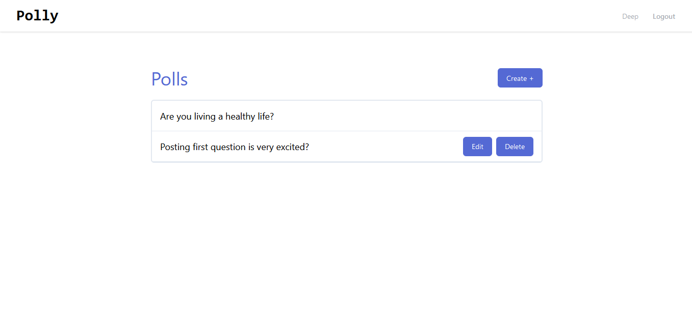
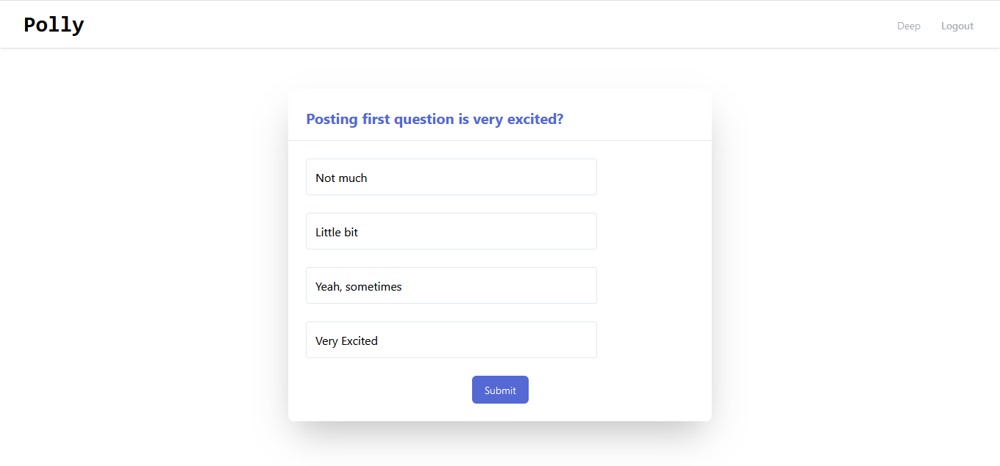
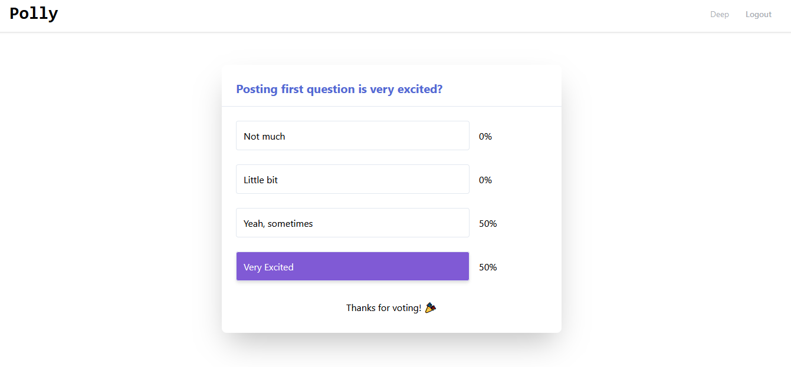

# Polly-App

A full web app that allow user to sign in and vote in any poll and also see the result of that poll. It's a real-world-like project, built with business specifications.

### Features
>1. Users can signup and login using email and create a poll.
>2. Each poll should have 4 options.
>3. Anyone can see all the polls listed on the homepage.
>4. To vote in a poll, the user needs to signup. One user can only vote on one option of a poll.
> 5. When one has voted in a poll, the user should be able to see the total votes and breakup for each poll option.


<div align="center">

[](https://github.com/Dipeshtwis/polly-app)
[](https://github.com/Dipeshtwis/polly-app/issues)
[](https://github.com/Dipeshtwis/polly-app/pulls)

</div>

## 📝 Contents

<p align="center">
<a href="#with">Built with</a>&nbsp;&nbsp;&nbsp;|&nbsp;&nbsp;&nbsp;
<a href="#sc">Screenshot</a>&nbsp;&nbsp;&nbsp;|&nbsp;&nbsp;&nbsp;
<a href="#ll">Live Demo Link</a>&nbsp;&nbsp;&nbsp;|&nbsp;&nbsp;&nbsp;
<a href="#gs">Getting started</a>&nbsp;&nbsp;&nbsp;|&nbsp;&nbsp;&nbsp;
<a href="#author">Author</a>
</p>

## 🔧 Built with<a name = "with"></a>

- Ruby on Rails (Version: 6.0.3.2)
- Ruby (Version: 2.7.1)
- Axios
- React.js

## Screenshot <a name = "sc"></a>

### Dashboard



### Poll before participated



### Poll after participated




## Live Demo Link <a name = "ll"></a>

[Live Demo]()


## Getting Started <a name = "gs"></a>

To get a local copy of the repository please run the following commands on your terminal:

```
$ cd <folder>
```

~~~bash
$ git clone git@github.com:Dipeshtwis/polly-app/.git
$ cd polly-app
$ bundle install
$ yarn install --check-files
~~~

<!-- Setup database with:

> make sure you have postgres sql installed and running on your local machine

> Go to config > database.yml

Replace ```xxx``` with your ```own``` postgres sql username and password instead of mine
```
username: xxx
password: xxx
``` -->

> create and migrate the database by these commands

```
   rails db:create
   rails db:migrate
```

### How to run

Start server with:

```
    rails s
```

Open `http://localhost:3000/` in your browser.


## ✒️  Authors <a name = "author"></a>


👤 **Dipesh Kumar**

- Github: [@Dipeshtwis](https://github.com/Dipeshtwis)
- Twitter: [@97deepeshkumar](https://twitter.com/97deepeshkumar)
- Linkedin: [dipeshtwis](https://www.linkedin.com/in/Dipeshtwis/)


## 🤝 Contributing

Contributions, issues and feature requests are welcome!

Feel free to check the [issues page](https://github.com/Dipeshtwis/polly-app/issues).


## 👍 Show your support

Give a ⭐️ if you like this project!

## :clap: Acknowledgements

- BigBinary: [@bigbinary](https://bigbinary.com/)
